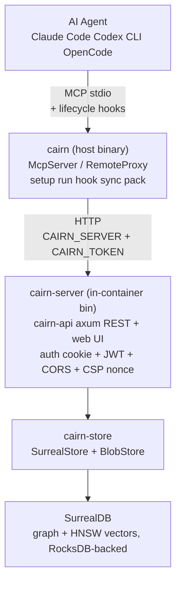
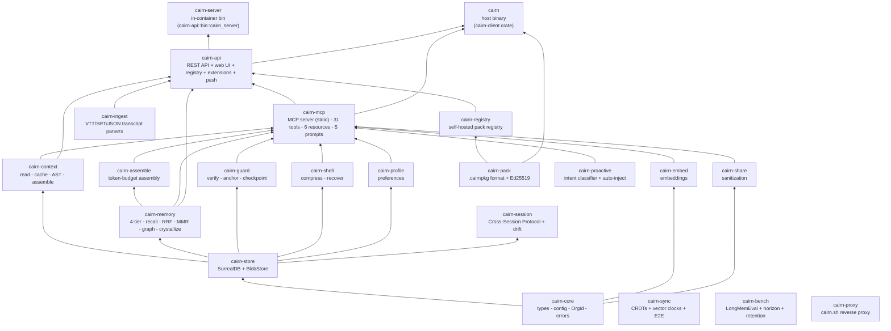

# Architecture

How Cairn is structured today - crate graph, data flow, MCP tool surface, API endpoints,
and Docker topology.

---

## System Overview



---

## One Host Binary + One In-Container Binary

| Binary | Lives in | Role |
|---|---|---|
| `cairn` (host) | release tarball + install script | Client: `mcp`, `setup`, `rules`, `run`, `hook`, `remember`, `recall`, `wakeup`, `prefer`, `anchor`, `checkpoint`, `rollback`, `sync`, `export`, `import`, `contribute`, `pull`, `bench`, `doctor`, `onboard`, `pack`, `graph`, `memory`, `search`, `sessions`, `session`, `metrics`, `stats` |
| `cairn-server` (in-container) | Docker image only | Long-lived server: binds :7777, serves the API + web UI, runs env-only admin bootstrap |

v0.5.0 shipped both as the same name (`cairn`); v0.6.0 split them so the
host tarball ships exactly one binary and the in-container server is
rebuilt only when the Docker image is rebuilt. See ADR-029.

---

## Cargo Workspace - 24 Crates

### Dependency Graph



### Crate Roles

| Crate | Role |
|---|---|
| `cairn-core` | Domain types, config resolution, errors, hashing, `OrgId`. No deps on other cairn crates. |
| `cairn-store` | SurrealDB backend (graph + vector) + content-hash `BlobStore`. Token/memory/checkpoint/audit persistence. |
| `cairn-context` | Read modes (full/signatures/map/auto), content-hash + mtime cache (~13-tok re-reads), tree-sitter AST outlines (11 languages), `expand` recovery, `diff_only` + `estimate_tokens` (pub), `BounceTracker`, `ContextLedger`. |
| `cairn-memory` | 4-tier memory (working/episodic/semantic/procedural), consolidation, Ebbinghaus decay, SHA-256 dedup, BM25 + semantic fusion via RRF, MMR diversity rerank, crystallize, provenance graph (6 edge types: `derived_from`, `contradicts`, `supersedes`, `applies_to`, `related_to`, `depends_on`), auto-derive edges from files + concepts. |
| `cairn-assemble` | Edge-ordered context assembly under a token budget. Anti-context-rot. |
| `cairn-guard` | Verify edits vs originals, task anchor, checkpoint/rollback, reliability scoring. |
| `cairn-shell` | RTK-style command-output compression (filter/group/dedup), lossless via blob store. |
| `cairn-profile` | Preference/behavior learning, injected at session start. |
| `cairn-share` | Privacy-first sanitization: secret/PII detection, redaction, classification (shareable/review/private). |
| `cairn-embed` | Pluggable embeddings: local (fastembed/ONNX all-MiniLM-L6-v2), OpenAI, Ollama, hashing fallback. |
| `cairn-document` | RAG document ingestion: paragraph-aware chunking, `read_source` (file/URL), `chunk_text`. No store access — caller persists chunks. |
| `cairn-rerank` | Cross-encoder reranking interface (fastembed/ONNX backend, `local` feature). |
| `cairn-session` | Cross-Session Protocol (JSONL sessions + drift log), approve/reject workflow. |
| `cairn-pack` | `.cairnpkg` format - hand-rolled ustar, SHA-256 per-file integrity, HMAC signature, Ed25519 signing. |
| `cairn-registry` | Self-hosted pack registry: HTTP endpoints under `/api/registry/*`, trust scopes, revocation cascade. |
| `cairn-sync` | Offline-first CRDT sync: `GCounter` + `ORSet` + vector clocks + Argon2id/ChaCha20-Poly1305 E2E encryption. |
| `cairn-bench` | LongMemEval + horizon + retention benchmarks with hand-built fixtures. |
| `cairn-proactive` | Intent classifier (local heuristic, sub-ms), `ProactiveHook`, per-project opt-out. |
| `cairn-proxy` | `cairn.sh` reverse proxy: parallel fan-out to multiple registries, best-effort merge. |
| `cairn-ingest` | VTT/SRT/JSON transcript parsers + speaker-window chunking (default 60s). |
| `cairn-mcp` | MCP server over stdio. Local mode (opens the SurrealDB store) or remote proxy mode (forwards to `cairn-api`). 31 tools, 6 resources, 5 prompts. `McpServer::from_engines()` shares AppState's `Arc` handles. `RemoteProxy` with `LocalReader` (mtime cache + diff). |
| `cairn-api` | Axum REST API + embedded web UI (rust-embed). Auth middleware (cookie session + JWT device tokens), CORS, per-request CSP nonce. Registry + extensions + push + ingest routes. |
| `cairn-api` (bin `cairn-server`) | In-container entrypoint. Resolves config, opens the store, runs `bootstrap_admin_from_env`, binds :7777, serves the API + web UI. Built into the Docker image; never ships in host tarballs. |
| `cairn-client` | Host binary `cairn`: `mcp`, `setup`, `run`, `hook`, `sync`, `bench`, `pack`, `graph`, `memory`, `search`, `doctor`, `onboard`, etc. |

---

## MCP Tool Surface (31 tools)

All tools are exposed via `cairn mcp` (stdio) and mirrored at `/api/tools/list` + `/api/tools/call`.

| Category | Tools |
|---|---|
| **Context** | `read`, `expand` |
| **Memory** | `remember`, `recall`, `wakeup`, `consolidate`, `memory_edit`, `memory_delete`, `memory_pin`, `memory_promote`, `memory_reinforce`, `memory_timeline`, `memory_crystallize`, `memory_graph` |
| **Assembly** | `assemble` |
| **Guardrails** | `checkpoint`, `rollback`, `checkpoints`, `verify`, `verify_baseline`, `anchor` |
| **Profile** | `prefer`, `profile` |
| **Shell** | `compress` |
| **Sanitization** | `sanitize` |
| **Documents** | `document_ingest`, `document_search` |
| **Search** | `search` |
| **Metrics** | `metrics` |
| **Proactive** | `proactive_recall` |
| **Registry** | `registry_search` |

### MCP Resources (6)

| URI | Description |
|---|---|
| `cairn://memory/graph` | Nodes + edges of the current memory graph |
| `cairn://memory/timeline` | Most recent memories, newest first |
| `cairn://savings/today` | Token-savings ledger summary for the last 24h |
| `cairn://drift/pending` | Drift events awaiting user review |
| `cairn://audit/recent` | Most recent audit events |
| `cairn://config/toml` | Effective server configuration as TOML |

### MCP Prompts (5)

| Name | Description |
|---|---|
| `summarize-drift` | Summarise pending drift items |
| `remember-decision` | Compose a `remember` tool call from a decision description |
| `what-do-we-know` | Boot a fresh-agent recap with top-3 memories |
| `weekly-savings-report` | Generate a Markdown weekly savings report |
| `drift-triage` | Walk through pending drift items for approval |

---

## API Endpoints

### Public (no auth)

| Method | Path | Description |
|---|---|---|
| GET | `/api/health` | Server health + version |
| GET | `/api/health/deep` | Deep health (DB + embedder + config) |
| GET | `/api/auth/status` | Auth status (is a session active?) |
| POST | `/api/auth/login` | Admin login (sets `cairn_session` cookie) |
| POST | `/api/auth/setup` | First-run admin creation |
| GET | `/api/setup/health` | Setup wizard health check |
| GET | `/api/setup/embed-default` | Default embed provider for setup wizard |

### Authenticated (cookie or bearer token)

| Method | Path | Description |
|---|---|---|
| GET | `/api/tools/list` | MCP tool definitions |
| POST | `/api/tools/call` | Dispatch a tool by name (shared engines) |
| GET | `/api/capabilities` | Server capabilities (endpoints, tools, features) |
| GET | `/api/openapi.json` | OpenAPI spec |
| GET | `/api/config` | Effective config (read-only) |
| GET | `/api/stats` | Server stats (memory count, tokens saved, etc.) |
| GET | `/api/metrics` | Live cost-savings metrics |
| GET | `/api/metrics/savings` | Mobile savings snapshot |
| GET | `/api/events` | SSE event stream (with `Last-Event-ID` replay) |
| GET | `/api/ledger` | Savings ledger entries |
| GET | `/api/ledger/verify` | Verify HMAC chain integrity |
| GET | `/api/profile` | User preferences |
| POST | `/api/profile` | Record a preference (`prefer`) |
| POST | `/api/auth/logout` | Clear session cookie |
| GET | `/api/auth/me` | Current user info |

### Memory

| Method | Path | Description |
|---|---|---|
| GET | `/api/memory` | List memories (filter: scope, tier, kind, pinned, suspicious, q) |
| POST | `/api/memory` | Store a memory (scope-aware: defaults to Project when `X-Cairn-Project` set) |
| GET | `/api/memory/recall` | Recall by query (ranked by relevance + recency + importance) |
| GET | `/api/memory/wakeup` | Session-start bootstrap (highest-value memories) |
| POST | `/api/memory/consolidate` | Consolidate across tiers |
| POST | `/api/memory/crystallize` | Promote working-tier memories into a semantic crystal |
| GET | `/api/memory/graph` | Memory provenance graph (6 edge types) |
| GET | `/api/memory/heatmap` | Activity heatmap (daily counts) |
| GET | `/api/memory/architecture-report` | Architecture report (graph analysis) |
| GET | `/api/memory/by-scope` | Memories by exact scope (project/session/global) |
| GET | `/api/memory/promotion-candidates` | Project-scoped memories in the review band [0.70, 0.90] |
| GET | `/api/memory/promotion-log` | Promotion/demotion event log |
| GET | `/api/memory/autopilot-digest` | "Since you were away" digest (promotions, demotions, drift) |
| POST | `/api/memory/session-summary` | LLM-synthesized session summary |
| POST | `/api/memory/gotcha` | Record a failure event (auto-promotes to gotcha on cluster) |
| GET | `/api/memory/gotcha/wakeup` | Top-K gotcha clusters for proactive recall |
| GET | `/api/search` | Hybrid search (BM25 + semantic + graph, RRF-fused, MMR-reranked) |
| POST | `/api/memory/:id/pin` | Pin/unpin a memory |
| POST | `/api/memory/:id/reinforce` | Reinforce confidence (agentmemory curve) |
| POST | `/api/memory/:id/promote` | Approve a promotion candidate (moves to Global, locks) |
| POST | `/api/memory/:id/dismiss-promotion` | Dismiss a promotion candidate (locks without promoting) |
| POST | `/api/memory/:id/demote` | Undo a promotion (reverts to origin scope via promotion log) |

### Context + Guard

| Method | Path | Description |
|---|---|---|
| GET | `/api/context/read` | Read a file (cache-aware: Full/Cached/Diff/Outline) |
| GET | `/api/context/expand` | Recover original bytes for a content hash handle |
| GET | `/api/context/assemble` | Token-budgeted context assembly (memories + documents) |
| GET | `/api/context/pressure` | Context pressure gauge (ContextLedger) |
| POST | `/api/guard/verify` | Verify a proposed edit (flags large unreplaced deletions) |
| POST | `/api/guard/verify-baseline` | Verify current file vs read-time baseline (PostToolUse check) |
| GET | `/api/guard/anchor` | Get the current task anchor |
| POST | `/api/guard/anchor` | Set the task anchor |
| POST | `/api/guard/anchor/auto` | Auto-derive anchor from prompt (if none set) |
| POST | `/api/guard/checkpoint` | Snapshot tracked files |
| GET | `/api/guard/checkpoints` | List checkpoints |
| POST | `/api/guard/rollback` | Roll back to a checkpoint |
| GET | `/api/guard/drift` | Drift event log (filter: `?status=pending&limit=N`) |

### Shell + Share + Documents

| Method | Path | Description |
|---|---|---|
| POST | `/api/shell/compress` | Compress verbose command output |
| POST | `/api/share/sanitize` | Sanitize text for secrets/PII |
| GET | `/api/share/export` | Export sanitized memory bundle |
| POST | `/api/share/import` | Import a sanitized bundle |
| GET | `/api/documents` | List ingested documents (filter: `?project_id=...`) |
| POST | `/api/documents/ingest` | Chunk and store a document (project-scoped) |
| GET | `/api/documents/search` | Semantic search over document chunks |
| DELETE | `/api/documents/:id` | Delete an ingested document |
| POST | `/api/ingest/transcript` | Ingest a transcript (VTT/SRT/JSON) |

### Devices + Sessions + Projects + Cron

| Method | Path | Description |
|---|---|---|
| GET | `/api/devices/tokens` | List device tokens |
| POST | `/api/devices/tokens` | Create a device token |
| POST | `/api/devices/tokens/:id/revoke` | Revoke a token |
| GET | `/api/devices/audit` | Audit log |
| POST | `/api/extensions/capture` | Browser extension capture (loopback-only) |
| POST | `/api/push/subscribe` | Subscribe to push notifications |
| POST | `/api/push/unsubscribe` | Unsubscribe |
| GET | `/api/push/list` | List push subscriptions |
| GET | `/api/sessions` | List sessions |
| POST | `/api/sessions` | Create a session |
| GET | `/api/sessions/latest` | Latest session |
| GET | `/api/sessions/:id` | Session detail |
| PATCH | `/api/sessions/:id` | Update a session |
| GET | `/api/projects` | List projects |
| GET | `/api/projects/:id` | Project detail |
| PATCH | `/api/projects/upsert` | Register/update a project (auto-detection) |
| GET | `/api/cron/jobs` | List cron jobs + last-run status |
| POST | `/api/cron/run/:job` | Manually trigger a cron job |
| GET | `/api/cron/history` | Cron run history |
| GET | `/api/cron/health` | Cron scheduler health |

### Registry + Pool + Sync (`/api/registry/*`, `/api/pool/*`, `/api/sync/*`)

| Method | Path | Description |
|---|---|---|
| GET | `/api/registry/packs` | List all packs |
| POST | `/api/registry/packs` | Publish a pack (raw tarball) |
| GET | `/api/registry/packs/:name` | List versions of a pack |
| GET | `/api/registry/packs/:name/:version/download` | Download a pack tarball |
| GET | `/api/registry/packs/:name/:version/manifest.json` | Fetch cached manifest |
| DELETE | `/api/registry/packs/:name/:version` | Revoke a pack |
| GET | `/api/registry/search` | Search packs (`?q=...`) |
| GET | `/api/registry/trusted-keys` | List trust grants |
| GET | `/api/registry/revocations` | Revocation log (`?since=<unix>`) |
| GET | `/api/pool` | List pool contributions |
| POST | `/api/pool/contribute` | Contribute sanitized knowledge to the pool |
| GET | `/api/sync/pull` | Pull sync data (CRDT) |
| POST | `/api/sync/push` | Push sync data (CRDT) |

---

## Config Precedence

CLI flag > env var > project `.env` > `~/.config/cairn/.env` > built-in default.

| Env var | Default | Description |
|---|---|---|
| `CAIRN_DATA_DIR` | OS data dir | Data directory |
| `CAIRN_HOST` | `127.0.0.1` | Serve bind host |
| `CAIRN_PORT` | `7777` | Serve bind port |
| `CAIRN_DB_URL` | `ws://localhost:8000` | SurrealDB server URL |
| `CAIRN_DB_USER` | `root` | SurrealDB root/auth username |
| `CAIRN_DB_PASS` | (empty) | SurrealDB root/auth password |
| `CAIRN_DB_NS` | `cairn` | SurrealDB namespace (isolation boundary for multi-instance/tests) |
| `CAIRN_DB_TIMEOUT_SECS` | `10` | Per-query deadline for SurrealDB |
| `CAIRN_SECRET_KEY` | (required) | HMAC secret for JWTs ( 32 bytes) |
| `CAIRN_TLS_CERT` / `CAIRN_TLS_KEY` | (none) | TLS material for HTTPS |
| `CAIRN_INSECURE` | `0` | Allow plain HTTP on non-loopback |
| `CAIRN_WORKSPACE_ROOT` | (none) | Project root for context engine |
| `CAIRN_CORS_ORIGINS` | (empty) | Allowed CORS origins (comma-separated) |
| `CAIRN_EMBED_PROVIDER` | `local` | Embedding provider: `hashing` / `ollama` / `openai` |
| `CAIRN_ADMIN_USERNAME` | `admin` | Admin username |
| `CAIRN_ADMIN_PASSWORD` | (none) | Admin password (plaintext; loopback dev only) |
| `CAIRN_ADMIN_PASSWORD_HASH` | (none) | Admin password hash (Argon2id PHC; production) |
| `CAIRN_MULTI_TENANT` | `0` | Enable multi-tenant org isolation |
| `CAIRN_SESSION_TTL_DAYS` | `2` | Days a `Session`-scoped memory can go untouched before the nightly `session-gc` cron job promotes it to `Global` (v0.8.0). `0` disables the job. |
| `CAIRN_DECAY_PERIOD_DAYS` | `30` | Confidence half-life for the weekly `memory-decay` cron job (v0.8.0) |
| `CAIRN_ACCESS_LOG_RETENTION_DAYS` | `90` | How long `access_log` rows are kept before the monthly `access-log-prune` cron job deletes them (v0.8.0) |
| `CAIRN_CRON_ENABLED` | `1` | Whether the in-process cron scheduler runs at all (v0.8.0). Set `0` on a horizontally-scaled deployment where only one replica should run cron. |
| `CAIRN_LLM_CONSOLIDATION` | `0` | Master gate for every LLM-driven background job: consolidation, query expansion, and (v0.8.0) the daily `llm-intelligence` cron job (concept extraction, contradiction detection, promotion scoring, session synthesis) |
| `CAIRN_LLM_CONSOLIDATION_URL` | `http://localhost:11434/v1/chat/completions` | OpenAI-compatible chat completion endpoint |
| `CAIRN_LLM_CONSOLIDATION_MODEL` | `llama3.2` | Model name sent in the chat completion request |
| `CAIRN_LLM_CONSOLIDATION_API_KEY` | (none) | API key for hosted providers (unset = no `Authorization` header, e.g. local Ollama) |
| `CAIRN_SERVER` | (none) | Remote cairn-server URL for `cairn mcp` proxy mode |
| `CAIRN_TOKEN` | (none) | Bearer token for remote proxy mode |

---

## Docker Topology

```
docker compose up -d
  -> surreal-guard (one-shot: validates SURREAL_PASS)
  -> surreal       (SurrealDB graph + vector datastore, no host port)
  -> cairn-init    (one-shot: chowns /data to uid 10001)
  -> cairn         (Cairn server + web UI, 127.0.0.1:7777, non-root)
```

The `cairn` container runs as `user: "10001:10001"` (non-root). The `cairn-init`
one-shot chowns the `cairn-data` volume before the server starts.

---

## Connecting an agent by hand

### OpenCode

Add to `~/.config/opencode/opencode.json` or `.mcp.json` in the project root:

```json
{
  "mcpServers": {
    "cairn": {
      "command": "cairn",
      "args": ["mcp"]
    }
  }
}
```

For remote mode, set `CAIRN_SERVER=http://<host>:7777` and `CAIRN_TOKEN=<token>`.

### Claude Code

Add lifecycle hooks to `.claude/settings.json`:

```json
{
  "hooks": {
    "SessionStart": [{ "hooks": [{ "command": "cairn hook SessionStart", "type": "command" }] }],
    "SessionEnd": [{ "hooks": [{ "command": "cairn hook SessionEnd", "type": "command" }] }],
    "PostToolUse": [{ "matcher": "Edit|Write|MultiEdit", "hooks": [{ "command": "cairn hook PostToolUse", "type": "command" }] }]
  }
}
```

And add the MCP entry to `.mcp.json` (same as OpenCode above).

### Codex CLI

`cairn setup codex` writes the `[mcp_servers.cairn]` block to
`~/.codex/config.toml` (or `<project>/.codex/config.toml` for project scope).
Codex reads TOML, not JSON - the block uses stdio transport with
`command = "cairn"` and `args = ["mcp"]`. When `--server` is passed we
also write a `[mcp_servers.cairn.env]` sub-block with
`CAIRN_SERVER` and `CAIRN_TOKEN`.

---

## See also

- [Plan v0.5.0](../archive/plan-v0.5.0.md) - 23-sprint plan, success metrics, risks
- [Benchmarks](../testing/benchmarks.md) - measured token savings + methodology
- [Decisions](decisions.md) - 33 ADRs
- [Roadmap](../planning/roadmap.md) - what's done, what's next
- [Security](../../SECURITY.md) - threat model + hardening checklist
- [E2E Tests](../testing/e2e.md) - 20-scenario end-to-end test harness