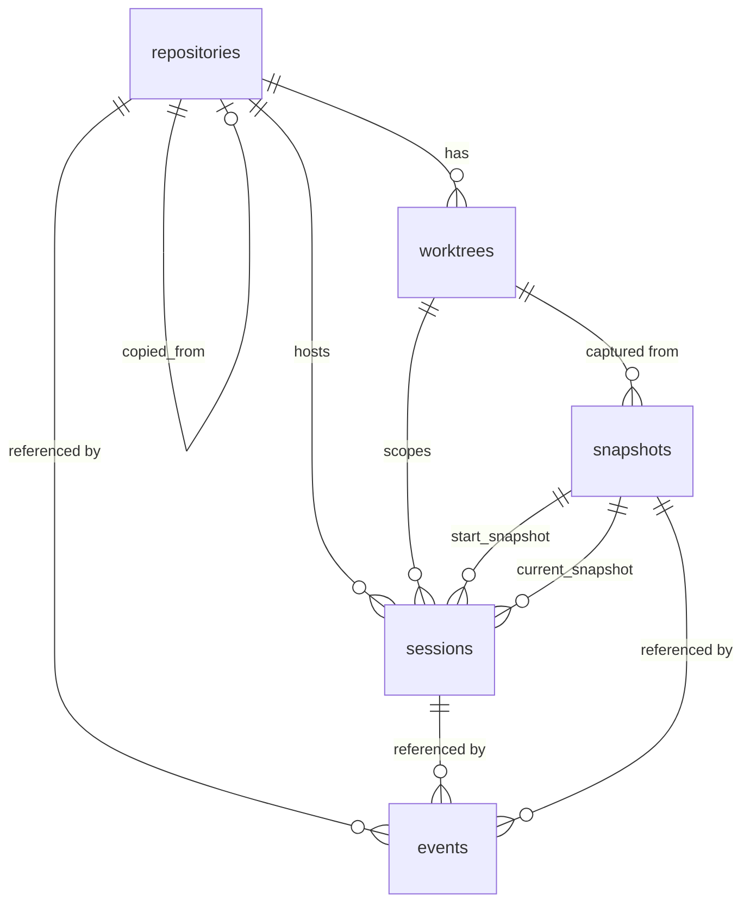

# Data Model: Local Session Foundation

**Feature**: 001-local-session-foundation | **Date**: 2026-07-16
**Storage**: per-user SQLite (WAL) — see [research.md](research.md) R6.
**Migration DDL**: [contracts/migrations/0001_init.sql](contracts/migrations/0001_init.sql)

## Entity Overview



## Entities

### repositories

Registered working copies. Identity = Git-private UUID (FR-002, clarification Q1).

| Field | Type | Constraints | Notes |
|---|---|---|---|
| id | TEXT | PK | UUIDv7 (DB row identity) |
| repo_uuid | TEXT | UNIQUE NOT NULL | UUID stored in `<git-common-dir>/cairn/repository-id` |
| canonical_path | TEXT | NOT NULL | Current root path; **mutable** metadata |
| default_remote_name | TEXT | NULL | e.g. `origin`; absent for remoteless repos |
| default_remote_url | TEXT | NULL | |
| copied_from_repository_id | TEXT | NULL FK → repositories.id | Copy-detection relationship (Q1) |
| registered_at | TEXT | NOT NULL | RFC 3339 UTC |

Validation: registration is read-or-create on `repo_uuid` (FR-003 idempotence).
Non-Git directory ⇒ no row written (FR-004).

### worktrees

One row per working tree (main + linked). Per-worktree identity (Q1).

| Field | Type | Constraints | Notes |
|---|---|---|---|
| id | TEXT | PK | UUIDv7 |
| repository_id | TEXT | NOT NULL FK → repositories.id | |
| worktree_uuid | TEXT | UNIQUE NOT NULL | UUID in `<absolute-git-dir>/cairn/worktree-id` |
| path | TEXT | NOT NULL | Worktree root; mutable |
| is_main | INTEGER | NOT NULL (0/1) | |
| registered_at | TEXT | NOT NULL | |

### snapshots

Immutable (arch rule 2). Metadata + hashes only (FR-011). Deduplicated per worktree.

| Field | Type | Constraints | Notes |
|---|---|---|---|
| id | TEXT | PK | UUIDv7 |
| worktree_id | TEXT | NOT NULL FK → worktrees.id | |
| branch | TEXT | NULL | NULL ⇔ detached HEAD (FR-006) |
| head_commit | TEXT | NOT NULL | Full OID |
| staged_fp | TEXT | NOT NULL | BLAKE3 hex (research R2) |
| unstaged_fp | TEXT | NOT NULL | |
| untracked_fp | TEXT | NOT NULL | |
| snapshot_fp | TEXT | NOT NULL | BLAKE3 over components; UNIQUE(worktree_id, snapshot_fp) |
| fp_schema_version | INTEGER | NOT NULL | Algorithm version prefix (R2) |
| created_at | TEXT | NOT NULL | |

Re-snapshotting an unchanged state returns the existing row (determinism FR-009 +
storage dedupe). No UPDATE/DELETE ever issued; enforced by triggers.

### sessions

Projection (rebuildable from events, arch rule 4) with uniqueness enforcement.

| Field | Type | Constraints | Notes |
|---|---|---|---|
| id | TEXT | PK | UUIDv7 = stable session identifier (FR-014) |
| repository_id | TEXT | NOT NULL FK | |
| worktree_id | TEXT | NOT NULL FK | |
| local_user | TEXT | NOT NULL | OS username |
| agent_type | TEXT | NOT NULL | Caller-supplied name |
| agent_instance_id | TEXT | NOT NULL | Per-instance UUID (FR-017, Q1/Q2) |
| agent_pid | INTEGER | NULL | Supporting liveness metadata only — never primary identity (A1) |
| resume_token_hash | TEXT | NOT NULL | BLAKE3 of resume token; raw token never stored (R8) |
| lease_expires_at | TEXT | NOT NULL | Start = now + initial lease (long, configurable); heartbeat extends by TTL |
| state | TEXT | NOT NULL CHECK IN ('active','recovering','stopped','interrupted') | |
| start_snapshot_id | TEXT | NOT NULL FK → snapshots.id | Immutable after creation |
| current_snapshot_id | TEXT | NOT NULL FK → snapshots.id | Updated via events |
| started_at | TEXT | NOT NULL | |
| ended_at | TEXT | NULL | Set on stopped/interrupted |
| last_heartbeat_at | TEXT | NOT NULL | |
| recovering_since | TEXT | NULL | Persisted on first entry into recovering; preserved across restarts; grace deadline = recovering_since + grace period (A2) |

**Uniqueness (FR-017/FR-034)**: partial unique index
`UNIQUE(repository_id, agent_instance_id) WHERE state IN ('active','recovering')`.

**State machine** (FR-016/FR-018/FR-034, Q2/Q3, analysis A1/I3):

```text
            start
              │
              ▼
   ┌─────► active ──────── stop ────────► stopped        (terminal)
   │          │                              ▲
 reattach     ├── daemon restart ──────► recovering ── authenticated stop
 (valid token,│   (persist recovering_since │
 before grace │    if not already set)      ├── grace deadline expires
 deadline;    │                             │   (recovering_since + grace)
 emits        ◄─────────────────────────────┘            │
 session.recovered                                       ▼
 + fresh snapshot)                                  interrupted   (terminal)
              │
              ├── stale detected at colliding start ───► interrupted
              │   (lease expired; process_dead may        (+ new session created)
              │    confirm earlier; process_unknown never)
              └── watcher start failed ────────────────► interrupted
                  (install or post-install reconcile;
                   start request returns error)
```

Legal transitions only: `active→stopped`, `active→recovering`, `active→interrupted`
(stale takeover or watcher-start failure), `recovering→active` (authenticated reattach), `recovering→stopped`
(authenticated owner stop), `recovering→interrupted` (grace-deadline expiry only).
A failed reattachment (wrong/missing token) causes **no transition** — the request is
rejected with `LEASE_MISMATCH` and a `session.reattach_rejected` audit event is
appended. Terminal states never transition. Liveness determinations carry reason codes
`heartbeat_expired | process_dead | reattach_timeout | process_unknown`. `cairn-domain`
encodes this as a typed transition function; storage rejects anything else.

### events

Append-only evidence log (arch rules 3, 5, 6; FR-019/FR-020).

| Field | Type | Constraints | Notes |
|---|---|---|---|
| seq | INTEGER | PK AUTOINCREMENT | Total order; assigned inside the serialized per-worktree transaction (R7/I4) |
| id | TEXT | UNIQUE NOT NULL | UUIDv7 |
| idempotency_key | TEXT | UNIQUE NOT NULL | Deterministic per logical occurrence; duplicate returns prior result, projection not re-run (R7) |
| event_type | TEXT | NOT NULL | See catalog below |
| repository_id | TEXT | NULL FK | |
| worktree_id | TEXT | NULL FK | Enables worktree-filtered event listing |
| session_id | TEXT | NULL FK | |
| snapshot_id | TEXT | NULL FK | |
| payload | TEXT | NOT NULL | JSON, validated against per-type schema before insert |
| recorded_at | TEXT | NOT NULL | |

`BEFORE UPDATE` / `BEFORE DELETE` triggers `RAISE(ABORT)` — immutability enforced in
storage, not convention.

**Event catalog** (FR-019):

| event_type | Emitted when | Key payload fields |
|---|---|---|
| `repository.registered` | First successful init | repo_uuid, canonical_path, remote |
| `worktree.registered` | Worktree first seen | worktree_uuid, path, is_main |
| `snapshot.created` | New distinct fingerprint persisted | snapshot_fp, branch, head_commit, component fps |
| `session.started` | New session row created | agent_type, agent_instance_id, start_snapshot_id |
| `repository.state_changed` | Reconciliation yields fingerprint ≠ previous current | worktree_id, from_snapshot_id, to_snapshot_id |
| `branch.changed` | Branch/HEAD symbolic ref differs from previous snapshot | from_branch, to_branch, from_head, to_head |
| `session.stopped` | Explicit stop (active or recovering, authenticated) | session_id, final_snapshot_id |
| `session.interrupted` | Stale takeover, grace-deadline expiry, or watcher-start failure | session_id, reason (`stale_takeover` \| `grace_expired` \| `watcher_start_failed`), liveness_detail (`heartbeat_expired` \| `process_dead` \| `reattach_timeout` \| `process_unknown`) when applicable, watcher_stage (`install` \| `reconcile`) when reason is `watcher_start_failed` |
| `session.recovered` | Valid reattachment | session_id, fresh_snapshot_id |
| `session.reattach_rejected` | Reattachment with wrong/missing token (audit) | session_id, agent_instance_id presented, reason — **never token values** |
| `identity.marker_restored` | Missing identity marker restored from unique DB match (U1) | repository_id/worktree_id, restored_from (canonical path match) |

Append + projection update = one SQLite transaction (arch rule 5). Replaying events in
`seq` order MUST reproduce the `sessions` and `repositories`/`worktrees`
current-state projections exactly (replay test in `cairn-events`).

Watcher readiness is non-persisted coordination state. The OS watcher task acknowledges
installation and event-path readiness to the session-start orchestrator; only the resulting
post-install Git reconciliation and any session/snapshot/event projection changes are
persisted. A readiness failure uses the existing `active→interrupted` transition and
`session.interrupted` append path rather than introducing a parallel failure store.

### meta

| Field | Type | Notes |
|---|---|---|
| key | TEXT PK | e.g. `fp_schema_version`, `db_created_at` |
| value | TEXT | |

(Schema migration versioning itself is SQLx's `_sqlx_migrations` table.)

## Non-persisted view types (cairn-domain)

- **RepoStateInspection**: root, branch-or-detached, head, remote, staged[], unstaged[],
  untracked[], `IgnoredSummary`, worktree info — produced by `cairn-git` reconciliation,
  returned over IPC, never stored (spec: Repository State entity).
- **IgnoredSummary** (FR-035): total_count, by_source{gitignore, cairnignore},
  collapsed_roots[{path, count}], samples[≤20], truncated.

## Retention & growth

Events and snapshots are append-only and retained indefinitely (constitution III);
rows are metadata-sized (≤ ~1 KB). No pruning in this feature; compaction policy is a
future amendment if measured need arises (Principle IX).
