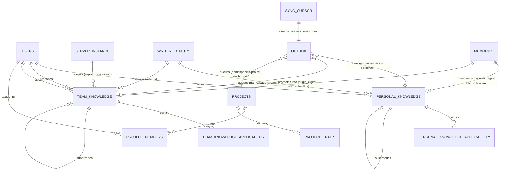

# Data Model: Cairn Collaborative Global Memory

**Feature**: `004-collaborative-global-memory` | **Baseline**: `main` @ `96178fc` (v0.1.0-alpha.5)
**Local schema**: 6 → 7. **Server schema**: 1 → 2 (Feature 003's server schema, in this codebase's
numbering, is `0002_project_intelligence.sql`; 004's server migration is `0003`, and its capability
name is `SCHEMA_3_CAPABILITIES` — the server-side migration count and the capability-name count are
tracked separately, and neither is renamed here).

Every change is additive except the one rebuild the brief requires: `outbox` widens its `entity_type`
`CHECK`, which SQLite cannot do without recreating the table (§2.12). No other existing migration is
edited and no existing row is rewritten (FR-523).

---

## 1. Domain is orthogonal to scope

**KnowledgeDomain** (`Project | Personal | Team`) answers *whose* knowledge a record is.
**MemoryScope** (`Project | Branch | Task | Session`, unchanged) answers *how narrow inside a project* a
project record is. The two are independent, and personal/team knowledge does not use `MemoryScope` at
all — it has no project to be narrow inside of (D401, FR-521).

Personal and team knowledge live in **two separate tables**, not one table with a domain discriminator
column: a forgotten `WHERE owner_user_id = ?` or `WHERE domain = ?` on a shared table is a privacy
breach waiting to happen, and separate tables make that mistake unwritable (D402).

Neither table has a `project_id` column, following the `reusable_patterns` precedent verbatim
(`0005_project_intelligence.sql:236-238`, D403): "a pattern that cannot name a project cannot leak one."
Each table's DDL below repeats that sentence as a comment, meant to be read at the table.

**Invariant — no cross-domain relations.** A relation row may never link records from two different
knowledge domains: `personal_knowledge_relations` (§2.3) references only `personal_knowledge` rows at
both ends, `team_knowledge_relations` (§2.7) only `team_knowledge` rows, and `memory_relations`
(`0005_project_intelligence.sql:103-118`) only `memories` rows. This is structural, not a rule a caller
could forget to check: there is no relations table whose `from_id`/`to_id` pair can name one domain's
row on one side and another domain's row on the other, so there is no table in which a cross-domain
edge could even be stored. A relation is the one construct that derives one record's meaning from
another's; without this invariant it would be the one way a private personal note could leak into a
team-visible or project-visible derivation.

---

## 2. Local SQLite — migration `0007_collaborative_global_memory.sql`

### 2.1 `personal_knowledge`

```sql
-- One user's durable knowledge, following that user across every project they
-- touch and every device they use. There is deliberately NO `project_id`
-- column: a record that cannot name a project cannot leak one
-- (0005_project_intelligence.sql:236-238, D403, FR-517).
-- NOT server-bound: unlike team_knowledge, this table is never refused on
-- server-instance mismatch (D438, FR-567). One local store can hold the
-- personal knowledge of more than one identity — e.g. after relinking to a
-- different server, where the same human is a different account — and rows
-- are partitioned by owner_user_id; recall surfaces only the currently
-- linked identity's rows.
CREATE TABLE IF NOT EXISTS personal_knowledge (
    id                  TEXT PRIMARY KEY,
    owner_user_id       TEXT NOT NULL,
    -- Reuses the existing five-value memory-type vocabulary (fact, decision,
    -- convention, failure, procedure) rather than inventing a parallel one:
    -- the classification a fact belongs to does not change because of who it
    -- belongs to.
    knowledge_type      TEXT NOT NULL CHECK (knowledge_type IN (
        'fact', 'decision', 'convention', 'failure', 'procedure')),
    content             TEXT NOT NULL,
    topic_key           TEXT,
    value_key           TEXT,
    -- Local only, never transmitted (§6). Exact-duplicate detection, same
    -- construction as `memories.content_norm_digest` (`knowledge.rs:121-138`).
    content_norm_digest TEXT,
    -- Local only, never transmitted (§6, D434). Set only when this record was
    -- created by promotion (D418); NULL for a personal note recorded
    -- directly. A salted digest of the source project's identity, computed
    -- with this machine's local salt — never the identity itself, and never
    -- comparable across machines by design (FR-516, FR-551, FR-552).
    origin_digest       TEXT,
    -- This store's opaque writer identity and this row's position in that
    -- writer's stream (D407, D408, FR-445). Never compared across writers.
    writer_id           TEXT NOT NULL,
    writer_seq          INTEGER NOT NULL,
    created_at          TEXT NOT NULL,
    -- Cached pointer, maintained the same way memories.superseded_by_id is:
    -- derived from a `supersedes` row in personal_knowledge_relations and
    -- rebuildable from it (§2.3). Not a violation of "immutable after
    -- creation" (D405) any more than the same cache is for memories today —
    -- content is never rewritten; this pointer is maintenance state.
    superseded_by_id    TEXT REFERENCES personal_knowledge(id),
    -- Tombstone. A personal note is forgotten, never edited (FR-440, FR-441).
    forgotten_at        TEXT,
    CHECK (value_key IS NULL OR topic_key IS NOT NULL)
);

CREATE INDEX IF NOT EXISTS personal_knowledge_owner
    ON personal_knowledge (owner_user_id, forgotten_at);
CREATE INDEX IF NOT EXISTS personal_knowledge_topic
    ON personal_knowledge (owner_user_id, topic_key) WHERE topic_key IS NOT NULL;
CREATE INDEX IF NOT EXISTS personal_knowledge_content_norm
    ON personal_knowledge (owner_user_id, content_norm_digest)
    WHERE content_norm_digest IS NOT NULL;
-- Gap/duplicate detection within one writer's stream (D408, FR-445, FR-492).
CREATE UNIQUE INDEX IF NOT EXISTS personal_knowledge_writer_seq
    ON personal_knowledge (writer_id, writer_seq);
```

`owner_user_id` exists because a personal record's whole access-control rule is "belongs to exactly one
user, visible to no other" (FR-432) — this single column *is* the privacy boundary, where every other
Cairn table's boundary is `project_id` plus membership. Because personal knowledge is not server-bound
(D438, FR-567), this same column is also what makes it safe for one local store to hold more than one
identity's rows at once: `owner_user_id` is a server-issued account identifier, distinct per server, so
two identities of the same human relinking across servers land as two different `owner_user_id` values in
the same table, never merged. `writer_id`/`writer_seq` exist because two
devices under one identity can each create a note offline, and FR-491/FR-492 need a way to tell "my own
two writes" apart from "two writers' byte-identical writes" without a clock — the same role
`tasks.local_revision` plays (`0005_project_intelligence.sql:371-374`, "a monotone counter for THIS
store only"), extended to a per-writer sequence since more than one writer's rows now land in one table.

### 2.2 `personal_knowledge_applicability`

```sql
-- Zero or more conditions under which a personal record applies to a project.
-- No row for a record means universal (D411, FR-435). Applicability is
-- set-membership over a closed vocabulary, never a score (D410, FR-434).
CREATE TABLE IF NOT EXISTS personal_knowledge_applicability (
    personal_id TEXT NOT NULL REFERENCES personal_knowledge(id),
    kind        TEXT NOT NULL CHECK (kind IN ('language', 'tool')),
    value       TEXT NOT NULL,
    PRIMARY KEY (personal_id, kind, value)
);
```

`value` has no DDL `CHECK` because SQLite's `GLOB`/`LIKE` cannot express "normalized by
`normalize_value_key`, then `[a-z0-9_]{1,64}`" (D410) as one readable constraint; it is validated at the
same repository boundary that already validates `topic_key`/`value_key` for memories (`constraints.rs`),
refused rather than silently dropped (FR-446). `kind` *is* a `CHECK` because it is a closed two-value
vocabulary with no normalization step — the enumeration itself is the whole rule (D414). The vocabulary is
`language | tool` only: `topic` was removed (D439, FR-569) because project traits are derived
deterministically from files present in a working tree — manifest and lockfile presence — and a
project's "topic" cannot be derived that way without reading semantic content or running a model. A
vocabulary member that can never match would silently make records inapplicable everywhere, which is
worse than no member at all.

An applicability fact (this table's `kind`/`value` pair) is unrelated to a record's own `topic_key`
column (§2.1): `topic_key` is the knowledge's own subject key, inherited unchanged from Feature 003, and
answers "what is this record about." An applicability fact answers a different question — "which
projects does this record apply to" — and is drawn from the closed `language | tool` vocabulary above.
Both were previously conflated under the word "topic"; they are unrelated facts about a record and must
not be conflated in documentation (FR-570).

### 2.3 `personal_knowledge_relations`

```sql
-- Reconciliation among one user's own personal entries, reusing 003's
-- write-time comparator and read-time derivation unchanged (D406). Same six
-- kinds as memory_relations, same primary key shape, same reason for it:
-- recording a decision twice is a no-op (003's memory_relations PK pattern, reused here).
CREATE TABLE IF NOT EXISTS personal_knowledge_relations (
    from_id    TEXT NOT NULL,
    to_id      TEXT NOT NULL,
    kind       TEXT NOT NULL CHECK (kind IN (
        'reinforces', 'duplicates', 'supersedes',
        'conflicts_with', 'narrows', 'not_applicable_to')),
    basis      TEXT NOT NULL CHECK (basis IN (
        'deterministic_rule', 'evidence', 'explicit_agent', 'explicit_user')),
    decided_by_writer TEXT NOT NULL,
    decided_at TEXT NOT NULL,
    deleted_at TEXT,
    PRIMARY KEY (from_id, to_id, kind)
);

CREATE INDEX IF NOT EXISTS personal_knowledge_relations_to
    ON personal_knowledge_relations (to_id, kind);
```

`decided_by_writer` names the writer, not a session: personal-knowledge relations are decided by the
comparator running against one user's entries wherever recalled, with no project session in scope. No
`basis_evidence_id`: evidence facts are project-scoped and cannot attach to a project-less record (D419).

### 2.4 `personal_fts`

```sql
-- Mirrors memory_fts exactly (0002_memory_fts.sql): FTS5 external-content
-- table, same tokenizer, same three triggers. A separate index per domain
-- because BM25 scores from different corpora are not comparable (D425); no
-- cross-domain relevance comparator is invented.
CREATE VIRTUAL TABLE IF NOT EXISTS personal_fts USING fts5(
    content,
    content='personal_knowledge',
    content_rowid='rowid',
    tokenize='unicode61'
);

CREATE TRIGGER IF NOT EXISTS personal_knowledge_fts_ai
    AFTER INSERT ON personal_knowledge BEGIN
    INSERT INTO personal_fts(rowid, content) VALUES (new.rowid, new.content);
END;

CREATE TRIGGER IF NOT EXISTS personal_knowledge_fts_ad
    AFTER DELETE ON personal_knowledge BEGIN
    INSERT INTO personal_fts(personal_fts, rowid, content)
        VALUES ('delete', old.rowid, old.content);
END;

CREATE TRIGGER IF NOT EXISTS personal_knowledge_fts_au
    AFTER UPDATE ON personal_knowledge BEGIN
    INSERT INTO personal_fts(personal_fts, rowid, content)
        VALUES ('delete', old.rowid, old.content);
    INSERT INTO personal_fts(rowid, content) VALUES (new.rowid, new.content);
END;
```

The `_au` trigger fires only for the maintenance updates this table permits (the `superseded_by_id`
cache); content itself is never `UPDATE`d, so it never fires for a content change (D405).

### 2.5 `team_knowledge`

```sql
-- The server-wide default, proposed by any member and made authoritative only
-- by an admin. Immutable content, same as personal (D405); the one mutation
-- 004 allows is the state transition below (D409). No `project_id` column
-- (D403) — same sentence as personal_knowledge (§1).
CREATE TABLE IF NOT EXISTS team_knowledge (
    id                   TEXT PRIMARY KEY,
    knowledge_type       TEXT NOT NULL CHECK (knowledge_type IN (
        'fact', 'decision', 'convention', 'failure', 'procedure')),
    content              TEXT NOT NULL,
    topic_key            TEXT,
    value_key            TEXT,
    content_norm_digest  TEXT,
    -- Local only, never transmitted (§6, D434). Same construction and same
    -- per-machine scoping as personal_knowledge.origin_digest above
    -- (FR-516, FR-551, FR-552).
    origin_digest        TEXT,
    -- The one field this table's rows mutate in place, and only by CAS
    -- (D409, FR-454). Three values, so the CAS predicate is the state itself
    -- (`WHERE id = ? AND state = ?expected`) rather than a separate integer
    -- revision column like task_criteria's — there is nothing a numeric
    -- revision would express that the three-value state does not already.
    state                TEXT NOT NULL DEFAULT 'proposed' CHECK (state IN (
        'proposed', 'authoritative', 'retired')),
    -- Traceable reference only, never project-identifying content (FR-459).
    proposed_by_user_id  TEXT NOT NULL,
    ratified_by_user_id  TEXT,
    ratified_at          TEXT,
    writer_id            TEXT NOT NULL,
    writer_seq           INTEGER NOT NULL,
    created_at           TEXT NOT NULL,
    superseded_by_id     TEXT REFERENCES team_knowledge(id),
    retired_by_user_id   TEXT,
    retired_at           TEXT,
    CHECK (value_key IS NULL OR topic_key IS NOT NULL),
    -- Authoritative or retired both imply a ratification happened; retiring
    -- an entry that was never ratified is not a reachable transition
    -- (FR-453, FR-456).
    CHECK (state = 'proposed'
           OR (ratified_by_user_id IS NOT NULL AND ratified_at IS NOT NULL))
);

CREATE INDEX IF NOT EXISTS team_knowledge_state ON team_knowledge (state);
CREATE INDEX IF NOT EXISTS team_knowledge_topic
    ON team_knowledge (topic_key) WHERE topic_key IS NOT NULL;
CREATE INDEX IF NOT EXISTS team_knowledge_proposer
    ON team_knowledge (proposed_by_user_id, state);
CREATE UNIQUE INDEX IF NOT EXISTS team_knowledge_writer_seq
    ON team_knowledge (writer_id, writer_seq);
```

`team_knowledge_relations` (§2.7) gives team disagreement the same reconciliation path project and
personal knowledge already have, per D406/FR-493: "the same deterministic way as project knowledge — by
reconciliation and relations." `Duplicates` and `ConflictsWith` are detected automatically, by the same
comparator that reconciles project and personal knowledge (`RelationKind::is_automatic`,
`domain.rs:393-395`). `Supersedes` is written only by the ratifying admin, as a deliberate act, never
inferred: superseding a server-wide default is a curation decision, and the admin is already in the loop
at the moment of ratification, so there is no automatic-comparator path that could infer it on their
behalf. `superseded_by_id` above is the cache of that relation's outcome, maintained the same way
`memories.superseded_by_id` and `personal_knowledge.superseded_by_id` are (§2.1) — never itself the
source of truth. A standing `ConflictsWith` between two authoritative entries is a signal for an admin,
never auto-resolved (FR-462): both entries stay visible, with the disagreement surfaced, for as long as
nobody acts on it.

### 2.6 `team_knowledge_applicability`

```sql
-- Same shape and same closed vocabulary as personal_knowledge_applicability
-- (D410, FR-460): `language | tool` only, `topic` removed (D439, FR-569).
CREATE TABLE IF NOT EXISTS team_knowledge_applicability (
    team_id TEXT NOT NULL REFERENCES team_knowledge(id),
    kind    TEXT NOT NULL CHECK (kind IN ('language', 'tool')),
    value   TEXT NOT NULL,
    PRIMARY KEY (team_id, kind, value)
);
```

### 2.7 `team_knowledge_relations`

```sql
-- Reconciliation among team knowledge entries, same six kinds and same
-- primary-key shape as memory_relations (0005_project_intelligence.sql:
-- 103-118) and personal_knowledge_relations (§2.3): recording a decision
-- twice is a no-op. `duplicates` and `conflicts_with` are detected
-- automatically (`RelationKind::is_automatic`, `domain.rs:393-395`);
-- `supersedes` here is written only by the ratifying admin, as a deliberate
-- act, never inferred (see the prose after §2.5's DDL).
CREATE TABLE IF NOT EXISTS team_knowledge_relations (
    from_id    TEXT NOT NULL,
    to_id      TEXT NOT NULL,
    kind       TEXT NOT NULL CHECK (kind IN (
        'reinforces', 'duplicates', 'supersedes',
        'conflicts_with', 'narrows', 'not_applicable_to')),
    basis      TEXT NOT NULL CHECK (basis IN (
        'deterministic_rule', 'evidence', 'explicit_agent', 'explicit_user')),
    decided_by_writer TEXT NOT NULL,
    decided_at TEXT NOT NULL,
    deleted_at TEXT,
    PRIMARY KEY (from_id, to_id, kind)
);

CREATE INDEX IF NOT EXISTS team_knowledge_relations_to
    ON team_knowledge_relations (to_id, kind);
```

`decided_by_writer` names the writer, not an admin or a session, for the same reason
`personal_knowledge_relations` does (§2.3): the comparator that detects `duplicates`/`conflicts_with`
runs against team entries wherever recalled, with no admin action in scope for those two kinds; only a
`supersedes` row is the product of an admin's ratifying decision, and for that row `decided_by_writer`
names the writer identity of the store on which the admin acted. No `basis_evidence_id`: team knowledge,
like personal knowledge, is project-less, and evidence facts are project-scoped and cannot attach to a
project-less record (D419). A relation row here may reference only `team_knowledge` rows at both ends —
see §1's invariant.

### 2.8 `team_fts`

```sql
-- Mirrors memory_fts exactly, same as personal_fts (§2.4), over team_knowledge.
CREATE VIRTUAL TABLE IF NOT EXISTS team_fts USING fts5(
    content,
    content='team_knowledge',
    content_rowid='rowid',
    tokenize='unicode61'
);

CREATE TRIGGER IF NOT EXISTS team_knowledge_fts_ai
    AFTER INSERT ON team_knowledge BEGIN
    INSERT INTO team_fts(rowid, content) VALUES (new.rowid, new.content);
END;

CREATE TRIGGER IF NOT EXISTS team_knowledge_fts_ad
    AFTER DELETE ON team_knowledge BEGIN
    INSERT INTO team_fts(team_fts, rowid, content)
        VALUES ('delete', old.rowid, old.content);
END;

CREATE TRIGGER IF NOT EXISTS team_knowledge_fts_au
    AFTER UPDATE ON team_knowledge BEGIN
    INSERT INTO team_fts(team_fts, rowid, content)
        VALUES ('delete', old.rowid, old.content);
    INSERT INTO team_fts(rowid, content) VALUES (new.rowid, new.content);
END;
```

A `proposed` row is indexed by this trigger like any other — FTS indexing is not what hides a proposal
from recall. Visibility is enforced by every reader filtering `state = 'authoritative'` (FR-452), the
same separation of concerns `memories` already has between "is indexed" and "is active".

### 2.9 `project_traits`

```sql
-- A project's derived stack signals: manifest and lockfile presence only
-- (Cargo.toml => rust+cargo, package.json => node, pnpm-lock.yaml => pnpm,
-- Dockerfile => docker, etc. — D413). Derived from the repository, never
-- guessed (Constitution VI, FR-437). LOCAL ONLY, never synchronized (FR-438):
-- see §7.
CREATE TABLE IF NOT EXISTS project_traits (
    project_id TEXT NOT NULL REFERENCES projects(id),
    kind       TEXT NOT NULL CHECK (kind IN ('language', 'tool')),
    value      TEXT NOT NULL,
    PRIMARY KEY (project_id, kind, value)
);
```

`kind` reuses the `ApplicabilityKind` vocabulary rather than a separate trait taxonomy, because a trait
and an applicability fact are compared directly (D412) — a second vocabulary here would only give the
two lists room to drift. 004's derivation populates `language`/`tool` from manifest/lockfile presence;
`topic` is not a member of `ApplicabilityKind` at all (D439, FR-569) — it was removed from the closed
vocabulary entirely, not merely left unwritten, because it cannot be derived deterministically from files
present in a working tree the way `language` and `tool` can.

### 2.10 `writer_identity`

```sql
-- A single opaque identity for this local store, established once (D407,
-- FR-490). Not a device registry: no name, no lifecycle, no server-side
-- table. LOCAL ONLY, never synchronized: see §7.
CREATE TABLE IF NOT EXISTS writer_identity (
    id         INTEGER PRIMARY KEY CHECK (id = 1),
    writer_id  TEXT NOT NULL,
    created_at TEXT NOT NULL
);
```

The `CHECK (id = 1)` singleton pattern is new here but is the simplest correct way to state "exactly one
row, forever" in SQLite DDL — every other Cairn singleton is singleton-per-key, not per-table. `writer_id`
is generated once, by this migration's Rust finish-hook (mirroring the machine-salt creation-race
handling already used for `reusable_patterns.origin_ref`, `cairn-core/src/paths.rs:97-124`), and never
regenerated.

### 2.11 `sync_cursor`

```sql
-- One pull position per synchronization namespace, replacing the single
-- project-keyed cursor in sync_meta (D426, FR-486, FR-487). Backfilled from
-- sync_meta (migration.md).
CREATE TABLE IF NOT EXISTS sync_cursor (
    namespace         TEXT PRIMARY KEY,
    pull_cursor       TEXT,
    last_success_at   TEXT,
    -- Per-namespace backoff state (D427, FR-497) — the mechanism that keeps a
    -- blocked team or personal namespace from throttling project sync, which
    -- the single process-global backoff at cairnd/src/sync.rs:56-118 cannot
    -- do today.
    backoff_until     TEXT,
    -- The last capability fingerprint observed for whatever this namespace
    -- talks to, replacing sync_meta.server_capability's single value
    -- (FR-498).
    server_capability TEXT
);
```

A namespace's key is one of `project:<project_uuid>`, `personal:<server_instance_id>:<user_uuid>`, or
`team:<server_instance_id>` (D426, §4 `SyncNamespace`). The personal key carries both the server instance
and the owning account, not the account alone (D438, FR-568): personal knowledge is not server-bound the
way team knowledge is (a local store may hold more than one identity's personal knowledge, §2.1), but
user identity is itself per-server, so keying on the account alone would risk merging two identities of
the same human if the same account identifier were ever reused; keying on both makes that impossible by
construction. Team stays keyed on `server_instance_id` alone because team knowledge genuinely is
server-wide and singular (FR-496) — there is only ever one team namespace per linked server, never one
per account. `pull_cursor`, `last_success_at` and
`backoff_until` are nullable because a freshly-created namespace has never synced yet — the same
reasoning `sync_meta` already applies to a never-synced project. The brief's own list names only
`namespace` and `pull_cursor`; `last_success_at`, `backoff_until` and `server_capability` are added here
because D427/D428 need per-namespace state to live somewhere, and this is where `sync_meta` already kept
the equivalent project-scoped fields.

### 2.12 `outbox` — rebuilt

SQLite cannot widen a `CHECK` in place; `0005_project_intelligence.sql:441-492` already rebuilt this
exact table for this exact reason (adding `memory_relation`, `task_criterion`, `task_blocker` and the
`blocked` state), so the precedent and its cost are established (FR-528, FR-530). This is the one
non-additive step in migration `0007`.

```sql
CREATE TABLE outbox_new (
    id                    TEXT PRIMARY KEY,
    -- Nullable now: a personal_knowledge/team_knowledge row belongs to no
    -- project, so it has none to name. The CHECK below makes "nullable for
    -- exactly the two domain-knowledge types, populated for every other type"
    -- a constraint the database enforces rather than a convention a caller
    -- must remember.
    project_id            TEXT REFERENCES projects(id),
    server_project_id     TEXT,
    entity_type           TEXT NOT NULL CHECK (entity_type IN (
        'project', 'task', 'session', 'memory', 'handoff',
        'memory_relation', 'task_criterion', 'task_blocker',
        'personal_knowledge', 'team_knowledge')),
    entity_id             TEXT NOT NULL,
    operation             TEXT NOT NULL CHECK (operation IN ('upsert', 'delete')),
    idempotency_key       TEXT NOT NULL UNIQUE,
    payload               TEXT NOT NULL,
    state                 TEXT NOT NULL DEFAULT 'pending'
        CHECK (state IN ('pending', 'in_flight', 'delivered', 'failed', 'blocked')),
    attempts              INTEGER NOT NULL DEFAULT 0,
    last_error            TEXT,
    created_at            TEXT NOT NULL,
    delivered_at          TEXT,
    claimed_at            TEXT,
    blocked_reason        TEXT,
    blocked_at_capability TEXT,
    -- The routing and backoff key (D426, D427). For the eight pre-existing
    -- entity types this is always `project:<project_id>`; for the two new
    -- types it is `personal:<server_instance_id>:<owner_user_id>` (D438,
    -- FR-568) or `team:<server_instance_id>`.
    namespace             TEXT NOT NULL,
    CHECK ((entity_type IN ('personal_knowledge', 'team_knowledge'))
           = (project_id IS NULL))
);

INSERT INTO outbox_new
    (id, project_id, server_project_id, entity_type, entity_id, operation,
     idempotency_key, payload, state, attempts, last_error, created_at,
     delivered_at, claimed_at, blocked_reason, blocked_at_capability, namespace)
SELECT id, project_id, server_project_id, entity_type, entity_id, operation,
       idempotency_key, payload, state, attempts, last_error, created_at,
       delivered_at, claimed_at, blocked_reason, blocked_at_capability,
       'project:' || project_id
  FROM outbox;

DROP TABLE outbox;
ALTER TABLE outbox_new RENAME TO outbox;

CREATE INDEX IF NOT EXISTS outbox_pending ON outbox (state, created_at);
-- Replaces outbox_claimable's (project_id, ...) shape: the claim predicate
-- moves from "this project" to "this namespace" (D427), and project rows'
-- namespace is exactly their project_id restated, so this index serves every
-- claim query, project or global, with one definition.
CREATE INDEX IF NOT EXISTS outbox_claimable
    ON outbox (namespace, state, created_at);
```

Full rebuild recipe, ordering and the proof obligation are in
[migration.md](./migration.md) §Local migration.

---

## 3. Server PostgreSQL — migration `0003_collaborative_global_memory.sql`

### 3.1 `users` — additive columns

```sql
ALTER TABLE users ADD COLUMN IF NOT EXISTS role
    TEXT NOT NULL DEFAULT 'member' CHECK (role IN ('admin', 'member'));
ALTER TABLE users ADD COLUMN IF NOT EXISTS status
    TEXT NOT NULL DEFAULT 'active' CHECK (status IN ('active', 'disabled'));
ALTER TABLE users ADD COLUMN IF NOT EXISTS must_change_password
    BOOLEAN NOT NULL DEFAULT false;
ALTER TABLE users ADD COLUMN IF NOT EXISTS password_changed_at TIMESTAMPTZ;
```

`role` and `status` exist because neither concept exists anywhere in `cairn-server` today (inv-A §2:
"grep for `role|is_admin|admin_id|superuser`... returns nothing"). `must_change_password` closes the
hole FR-407 names explicitly: a temporary password that could mint a permanent, non-expiring token
would make the one-time-password guarantee cosmetic. `password_changed_at` makes "ending the
requirement" (FR-405) a timestamped fact rather than just a cleared flag.

**Administrator password reset (D435) needs no new column beyond the four above.** Walking FR-553..559
against the existing schema:

- **FR-553/554** (reset, new temporary password shown once): behavior only — the new password's hash
  overwrites the row's existing hash; the plaintext itself is never stored, so there is nothing for a
  column to make "unretrievable" that isn't already true of every password on this table.
- **FR-555** (previous password invalidated immediately): the same overwrite makes the previous hash
  unreachable; no column needed.
- **FR-556** (every API token revoked): reuses `api_tokens.expires_at` (§3.4) — a reset sets every token
  row for that account to `expires_at = now()`, which is exactly what "no longer authenticates" already
  means for that column. This is not a new revocation concept, so it gets no new column; adding one would
  duplicate what `expires_at` already answers.
- **FR-557** (`must_change_password` set): the existing column (above), same one self-service password
  creation already sets — a reset and an initial temporary password are the same downstream state.
- **FR-558** (reset MUST NOT touch `status`): behavior only — the reset code path does not write `status`
  at all; there is no column interaction to add.
- **FR-559** (refused for the environment-seeded admin account): behavior only — the check compares the
  target account's email against the configured `CAIRN_ADMIN_EMAIL`, which is already readable server
  configuration, not a column on `users`.

No reset-specific audit column (e.g., "reset by", "reset at") is added: `password_changed_at` already
becomes a timestamped fact of the credential replacement regardless of whether it was a self-service
change or an administrator's reset (both are "the password changed just now"), and no FR asks this
feature to distinguish the two after the fact or to log which administrator performed a reset. Adding one
would be speculative scope beyond what FR-553..559 require, so it is left out, matching the additive-only
policy's discipline against inventing state nothing asks for.

### 3.2 `server_instance`

```sql
-- One row, ever. Generated once by this migration and never reassigned
-- (FR-415). Exposed unauthenticated at GET /api/version, the same posture as
-- schema_version (version.rs:54-72), so any client — including one that has
-- never linked anything — can discover which server instance it is talking
-- to (FR-416).
CREATE TABLE IF NOT EXISTS server_instance (
    id         UUID PRIMARY KEY CHECK (id = id),
    created_at TIMESTAMPTZ NOT NULL DEFAULT now()
);
```

PostgreSQL has no `CHECK (id = 1)` trick for a `UUID` column; the single-row invariant is enforced by
the migration inserting exactly one row and every reader querying
`SELECT id, created_at FROM server_instance LIMIT 1`. Immutability matters because `server_instance_id`
is what a local store pins its team knowledge to (FR-495/FR-496): if it could change, a second team's
guidance could silently merge into an existing store the moment an operator regenerated it.

### 3.3 `project_members` — additive columns

```sql
ALTER TABLE project_members ADD COLUMN IF NOT EXISTS added_by_user_id
    UUID REFERENCES users(id);
```

FR-419 requires every addition to record who added the member and when. `created_at`
(`cairn-server/migrations/0001_init.sql:52`) already answers "when" for every row, existing and new — a
second timestamp column would only duplicate it, so none is added. `added_by_user_id` is the one new
fact FR-419 needs: a pre-existing row backfills it to `NULL`, because who added that pre-existing
membership was never recorded, and fabricating an answer would violate the additive-only policy's rule
against inventing unrecorded state — the same rule that leaves `topic_key` and `stale_at` `NULL` rather
than guessed (`migration.md` §7). See [migration.md](./migration.md) for the backfill statement.

### 3.4 `api_tokens.expires_at`

```sql
ALTER TABLE api_tokens ADD COLUMN IF NOT EXISTS expires_at TIMESTAMPTZ;
```

Optional (FR-417: tokens MAY still be issued with none). `NULL` means what it means today for every
existing token: no expiry. This is explicitly **not** a fix for the fast-hash-vs-Argon2 non-finding the
brief calls out — tokens stay CSPRNG-random and fast-hashed; only an optional lifetime is added.
`token_hash` keeps using `cairn_core::digest`, which is correct for a 32-byte CSPRNG token; Argon2 would
be the wrong tool here and is deliberately not applied.

**A token past its `expires_at` is refused, indistinguishably from a revoked one (FR-585).** §3.1's
password-reset flow (FR-556) already revokes by writing to this same column — a reset sets every
affected token's `expires_at` to `now()` — so "expired" and "revoked-by-reset" are not two concepts
sharing one refusal message by policy; they are the **same** condition on the same column, checked by the
same `expires_at IS NOT NULL AND expires_at <= now()` predicate, on whichever request authenticates with
the token. There is no second code path to keep in sync and no way for a caller to distinguish "this
token's own lifetime ran out" from "an administrator reset the account it belongs to": the status and
body are identical because it is one check, not two checks made to agree (SC-452).

### 3.5–3.10 The six domain-knowledge tables

Server tables mirror their local counterparts with the columns the local-only section (§6) names
removed: no `content_norm_digest` (exact-duplicate detection is a local diagnostic that never needs to
leave the machine that computed it), and **no `origin_digest`** (D434, FR-551): the digest is computed
with a machine-local salt and is local-only by construction, exactly like `content_norm_digest` — it
MUST NOT be transmitted, because the server knows every project identity in its own database, and a
transmitted digest could be brute-forced against that list to recover which project a promotion came
from.

`writer_id` and `writer_seq` are the opposite case, and this document's earlier claim that they were
local-only, like `content_norm_digest`, was wrong (D448, re-derived per D456/F6): they **cross the wire**
and gain columns here, each under the same `UNIQUE (writer_id, writer_seq)` index the local table already
carries (FR-582), so the invariant is enforced on both sides rather than asserted on one. A per-writer
sequence is useful only to a *second* party — its entire purpose is to let a peer notice that record 7
arrived and record 6 never did (FR-492) — so unlike `content_norm_digest` and `origin_digest`, keeping
it server-absent would not protect anything; it would delete the one thing it exists to provide.
`writer_seq` remains diagnostic only (FR-583): nothing on the read or reconciliation path may consult it
as an ordering key, a tiebreak, or a conflict-resolution input. This is asserted structurally, not by
convention — §4's `ApplicabilityFact`/relation-comparator input carries no `writer_seq` field, the same
discipline that keeps a timestamp out of that same comparator's input today, so a tiebreak that tried to
consult it would not compile. Verified by SC-455: replaying a corpus under a reordered, withheld, or
renumbered writer sequence changes nothing about which record survives reconciliation or which is derived
as canonical.

No verification column exists on either knowledge table at all — not an authority, not a state, not a
timestamp (FR-513, FR-517) — so there is no verification field anywhere on this row for anything to
disagree with; see §4a for why this is asserted field by field rather than merely claimed.

```sql
CREATE TABLE IF NOT EXISTS personal_knowledge (
    id               UUID PRIMARY KEY,
    owner_user_id    UUID NOT NULL REFERENCES users(id) ON DELETE CASCADE,
    knowledge_type   TEXT NOT NULL CHECK (knowledge_type IN (
        'fact', 'decision', 'convention', 'failure', 'procedure')),
    content          TEXT NOT NULL,
    topic_key        TEXT,
    value_key        TEXT,
    writer_id        TEXT NOT NULL,
    writer_seq       BIGINT NOT NULL,
    created_at       TIMESTAMPTZ NOT NULL DEFAULT now(),
    superseded_by_id UUID,
    forgotten_at     TIMESTAMPTZ,
    CHECK (value_key IS NULL OR topic_key IS NOT NULL)
);

CREATE INDEX IF NOT EXISTS personal_knowledge_owner
    ON personal_knowledge (owner_user_id, forgotten_at);
CREATE UNIQUE INDEX IF NOT EXISTS personal_knowledge_writer_seq
    ON personal_knowledge (writer_id, writer_seq);

CREATE TABLE IF NOT EXISTS personal_knowledge_applicability (
    personal_id UUID NOT NULL REFERENCES personal_knowledge(id) ON DELETE CASCADE,
    kind        TEXT NOT NULL CHECK (kind IN ('language', 'tool')),
    value       TEXT NOT NULL,
    PRIMARY KEY (personal_id, kind, value)
);

CREATE TABLE IF NOT EXISTS personal_knowledge_relations (
    from_id    UUID NOT NULL,
    to_id      UUID NOT NULL,
    kind       TEXT NOT NULL CHECK (kind IN (
        'reinforces', 'duplicates', 'supersedes',
        'conflicts_with', 'narrows', 'not_applicable_to')),
    basis      TEXT NOT NULL,
    decided_at TIMESTAMPTZ NOT NULL DEFAULT now(),
    PRIMARY KEY (from_id, to_id, kind)
);

CREATE TABLE IF NOT EXISTS team_knowledge (
    id                  UUID PRIMARY KEY,
    knowledge_type      TEXT NOT NULL CHECK (knowledge_type IN (
        'fact', 'decision', 'convention', 'failure', 'procedure')),
    content             TEXT NOT NULL,
    topic_key           TEXT,
    value_key           TEXT,
    state               TEXT NOT NULL DEFAULT 'proposed'
        CHECK (state IN ('proposed', 'authoritative', 'retired')),
    proposed_by_user_id UUID NOT NULL REFERENCES users(id),
    ratified_by_user_id UUID REFERENCES users(id),
    ratified_at         TIMESTAMPTZ,
    writer_id           TEXT NOT NULL,
    writer_seq          BIGINT NOT NULL,
    created_at          TIMESTAMPTZ NOT NULL DEFAULT now(),
    superseded_by_id    UUID,
    retired_by_user_id  UUID REFERENCES users(id),
    retired_at          TIMESTAMPTZ,
    CHECK (value_key IS NULL OR topic_key IS NOT NULL),
    CHECK (state = 'proposed'
           OR (ratified_by_user_id IS NOT NULL AND ratified_at IS NOT NULL))
);

CREATE INDEX IF NOT EXISTS team_knowledge_state ON team_knowledge (state);
CREATE UNIQUE INDEX IF NOT EXISTS team_knowledge_writer_seq
    ON team_knowledge (writer_id, writer_seq);

CREATE TABLE IF NOT EXISTS team_knowledge_applicability (
    team_id UUID NOT NULL REFERENCES team_knowledge(id) ON DELETE CASCADE,
    kind    TEXT NOT NULL CHECK (kind IN ('language', 'tool')),
    value   TEXT NOT NULL,
    PRIMARY KEY (team_id, kind, value)
);

CREATE TABLE IF NOT EXISTS team_knowledge_relations (
    from_id    UUID NOT NULL,
    to_id      UUID NOT NULL,
    kind       TEXT NOT NULL CHECK (kind IN (
        'reinforces', 'duplicates', 'supersedes',
        'conflicts_with', 'narrows', 'not_applicable_to')),
    basis      TEXT NOT NULL,
    decided_at TIMESTAMPTZ NOT NULL DEFAULT now(),
    PRIMARY KEY (from_id, to_id, kind)
);
```

`team_knowledge_relations` mirrors `personal_knowledge_relations` the same way every other table in this
block mirrors its local counterpart (the opening paragraph, above): `decided_by_writer` and `deleted_at`
are dropped, but not for the reason this document previously gave (that reason no longer holds now that
`writer_id`/`writer_seq` cross the wire — D456/F6). The real, independent reason is that a relations row
is comparator *output*, not a fact a peer needs delivered to it: any store holding the same synced
knowledge rows recomputes the same `duplicates`/`conflicts_with` relations for itself, deterministically,
by reconciliation (FR-493) — unlike a writer's sequence, nothing about a relation decision is only
visible to a second party. `decided_by_writer` names which of *this* store's own comparator runs produced
the row, a purely local bookkeeping fact; `deleted_at` is a local soft-delete marker for the same
locally-recomputed row. Neither is information the server-held copy needs, because the server-held copy
is one durable statement of the relation, not a per-writer diagnostic about how one store arrived at it.
`personal_knowledge.superseded_by_id`, `team_knowledge.superseded_by_id`, and both relations tables'
`from_id`/`to_id` endpoints carry no `REFERENCES` on the server, matching the existing deliberate choice
for `memory_relations`' endpoints (`cairn-server/migrations/0002_project_intelligence.sql:53-69`): a hard
foreign key would refuse an insert that arrives before the row it names has synced, dropping it silently
instead of holding it for replay.

---

## 4. New `cairn-core` types

Declared with the existing `text_enum!` macro (`cairn-core/src/domain.rs:25-65`) where the type is a
closed string vocabulary, matching every existing enum's derives, `ALL`, `as_str`, `Display` and
`FromStr` round-trip.

```rust
// Whose knowledge a record belongs to (D401, FR-521); orthogonal to MemoryScope.
text_enum!(KnowledgeDomain, "knowledge domain", {
    Project => "project", Personal => "personal", Team => "team",
});

// The closed vocabulary an applicability fact's kind is drawn from (D410, D414).
// Exactly two members: both are derivable deterministically from files present
// in a working tree (manifest/lockfile presence), with no semantic content
// read and no model invoked. `topic` is NOT a member — it was removed (D439,
// FR-569) because it cannot be derived that way; a vocabulary member that can
// never match would silently make records inapplicable everywhere. Richer
// applicability requiring content inspection is deferred to Feature 005.
text_enum!(ApplicabilityKind, "applicability kind", {
    Language => "language", Tool => "tool",
});

// A team entry's lifecycle (FR-451..FR-465), advanced only by CAS (D409).
text_enum!(TeamState, "team knowledge state", {
    Proposed => "proposed", Authoritative => "authoritative", Retired => "retired",
});

// What a promotion targets (FR-506, D415); default "pattern" keeps today's behavior.
text_enum!(PromotionTarget, "promotion target", {
    Pattern => "pattern", Personal => "personal", Team => "team",
});

// A user's server-level standing (FR-402), independent of project membership.
text_enum!(ServerRole, "server role", { Admin => "admin", Member => "member" });

// Whether an account is active or disabled (FR-408..FR-410).
text_enum!(UserStatus, "user status", { Active => "active", Disabled => "disabled" });

/// One condition under which a record applies to a project (D410); no facts = universal (D411, FR-435).
pub struct ApplicabilityFact {
    pub kind: ApplicabilityKind,
    pub value: String, // normalize_value_key, then [a-z0-9_]{1,64} (D410, FR-446)
}

/// A single user's durable, project-less knowledge (FR-431..FR-446).
pub struct PersonalKnowledge {
    pub id: Uuid,
    pub owner_user_id: Uuid,
    pub knowledge_type: MemoryType,
    pub content: String,
    pub topic_key: Option<String>,
    pub value_key: Option<String>,
    /// Set only when created by promotion (D418); otherwise None. Local
    /// only — never transmitted (D434, FR-551); absent from the server
    /// wire representation of this type entirely.
    pub origin_digest: Option<String>,
    pub applicability: Vec<ApplicabilityFact>,
    /// This store's writer identity and this row's position in that
    /// writer's stream. Crosses the wire and has a server column (D448,
    /// FR-582) — unlike `origin_digest` above, a peer needs to see this to
    /// detect a gap in the writer's stream (FR-492). `writer_seq` is
    /// diagnostic only (FR-583): absent from every comparator/reconciliation
    /// input type, so nothing that decides an ordering or a conflict can
    /// see it (§4a).
    pub writer_id: Uuid,
    pub writer_seq: i64,
    pub created_at: DateTime<Utc>,
    pub superseded_by_id: Option<Uuid>,
    pub forgotten_at: Option<DateTime<Utc>>,
}

/// The server-wide default knowledge, begins proposed (FR-451..FR-465).
pub struct TeamKnowledge {
    pub id: Uuid,
    pub knowledge_type: MemoryType,
    pub content: String,
    pub topic_key: Option<String>,
    pub value_key: Option<String>,
    /// Local only — never transmitted (D434, FR-551); see PersonalKnowledge.
    pub origin_digest: Option<String>,
    pub applicability: Vec<ApplicabilityFact>,
    pub state: TeamState,
    pub proposed_by_user_id: Uuid,
    pub ratified_by_user_id: Option<Uuid>,
    pub ratified_at: Option<DateTime<Utc>>,
    /// Same wire-crossing, diagnostic-only stamp as `PersonalKnowledge`'s
    /// (D448, FR-582, FR-583) above.
    pub writer_id: Uuid,
    pub writer_seq: i64,
    pub created_at: DateTime<Utc>,
    pub superseded_by_id: Option<Uuid>,
    /// Who retired it, alongside `retired_at` (FR-457).
    ///
    /// Added during Phase 7: ratification recorded both halves and retirement
    /// recorded only the clock, which does not satisfy "every state transition
    /// MUST be recorded with who acted and when". Retirement is the transition
    /// most worth attributing — it removes guidance from every user on the
    /// server.
    pub retired_by_user_id: Option<Uuid>,
    pub retired_at: Option<DateTime<Utc>>,
}

/// The named reason a promotion attempt failed (FR-507, FR-520). Never
/// carries the offending content (FR-510).
pub struct PromotionRejection {
    /// The gate check that stopped it, e.g. "source_not_active",
    /// "absolute_path", "names_project" (FR-507).
    pub check: &'static str,
    /// The class matched, for content checks only — never the matched text
    /// itself (FR-510).
    pub class: Option<&'static str>,
}

/// The named reason the shared content validator rejected free-text content
/// or an applicability value (D433, FR-546, FR-547, FR-578). Carries a CLASS
/// ONLY — this is a structural guarantee, not a promise the caller must
/// honor: there is no field on this type into which the offending content
/// could be placed, so it is impossible for a caller to accidentally echo,
/// log, or return it (FR-547). `validate_global_content` is pure, total, and
/// shared across all FIVE entry points capable of creating global content —
/// direct personal creation, personal promotion, team proposal, team
/// promotion, and server-side synchronization ingest (D433, D447, FR-544,
/// FR-545, FR-577) — so no entry point can bypass it.
pub struct GlobalContentRejection {
    /// Which of the nine rejection classes matched: "absolute_path",
    /// "home_dir_ref", "drive_letter_path", "file_uri", "credentialed_url",
    /// "env_assignment", "encoded_secret_shape", "project_identifying", or
    /// "command_shaped" (FR-546). Never the matched text itself.
    pub class: &'static str,
}

/// One token identifying a project, screened for by the `project_identifying`
/// rejection class (D446, FR-546, FR-580): a project's name, a path
/// component of its shared identity (`git_common_dir`), or a remote host,
/// organisation, or repository token. This is the set to screen AGAINST, not
/// the value being screened. An empty slice means no project identity is
/// available and the `project_identifying` check PASSES rather than fails —
/// the single documented exception to fail-closed (FR-549, FR-580); see §4a.
pub struct ProjectIdentity(pub String);

/// A single local store's opaque, durable identity (D407, FR-490, FR-491).
/// Not a device registry entry: no name, no lifecycle, no server row.
pub struct WriterIdentity {
    pub writer_id: Uuid,
    pub created_at: DateTime<Utc>,
}

/// A fact about a project's stack, derived from its working tree, never
/// synchronized (D413, FR-437, FR-438).
pub struct ProjectTrait {
    pub kind: ApplicabilityKind,
    pub value: String,
}

/// One of the three independent synchronization lanes (D426, FR-486). Each
/// carries the identity that makes its cursor key unique. `Personal` carries
/// BOTH the server instance and the owning account (D438, FR-568), not the
/// account alone: personal knowledge is not server-bound the way team
/// knowledge is, but user identity is per-server, so the same human on two
/// servers is two different accounts — the namespace key partitions on both
/// so two identities of the same human never merge.
pub enum SyncNamespace {
    Project(Uuid),         // -> "project:<project_uuid>"
    Personal(Uuid, Uuid),  // -> "personal:<server_instance_id>:<user_uuid>"
    Team(Uuid),            // -> "team:<server_instance_id>"
}
```

`OutboxEntityType` (`cairn-core/src/domain.rs:164-174`) gains **four** variants —
`PersonalKnowledge`, `PersonalKnowledgeRelation`, `TeamKnowledge`, `TeamKnowledgeRelation` —
bringing it to twelve (FR-528).

This document said "exactly two variants… ten" until Phase 2 implementation reached it, and it
was wrong. `contracts/sync-namespaces.md` §6 had twelve, and §6 is right: both relations tables
exist in server Postgres as well as in this store (§3.5, `global-memory.md` §2), and a table on
the server is reachable only through the outbox. A relation also has nowhere else to travel —
unlike an applicability fact, which rides inside its knowledge row's payload, a relation names
*two* rows and belongs to neither, so it needs an entity type of its own. Two of the four are
therefore not optional: without them the relations tables on the server could never be
populated, and FR-493's "disagreement is expressed as relations" would hold locally and nowhere
else.

The corresponding `outbox.entity_type` CHECK lists all twelve, and the table's project-less
CHECK covers all four domain types rather than only the two knowledge ones: a relation between
two personal records has no more of a project than the records do. The existing
`outbox_cannot_carry_observations` test (`domain.rs:976-1012`) is extended to keep asserting the
now-ten-name set and to keep every Feature 003 local-only record absent from it, unchanged.

### 4a. Two privacy layers, honestly separated (D433, re-derived per D456/F11)

Every privacy guarantee this document states holds for exactly one of two distinct reasons, and this
document names which one for every guarantee (FR-550). The split below is derived field by field against
the actual declared schemas in §2 and §3 — not against the prose that used to describe them, which
mis-stated it in at least one place (D456/F11: a promoted record's "no verification authority above
`attested`" still admits a field, and this document previously said so). Verified by SC-467: an audit
over this document fails on the forbidden phrasing itself — "structurally incapable", "impossible by
construction", "no column exists" — appearing anywhere `content`, a topic key, a value key, or an
applicability value is being described, rather than relying on a reviewer to notice.

**Layer A — structurally impossible (no column exists).** `personal_knowledge` and `team_knowledge`
(§2.1, §2.5, §3.5) have no `project_id` column, no evidence-reference column, no observation-identifier
column, and — checked against both the stored row and every serialized wire form, in both stores — no
verification field of any kind: not an authority, not a state, not a timestamp (FR-513, FR-517). There is
nowhere in the row to put any of these five values, so no validator could fail to catch one and no caller
could bypass one; a test that adds such a field to either store's schema or wire form fails (SC-422,
SC-424). This is the only category "structurally impossible" may describe.

**Layer B — validated (free text is checked).** Everything else capable of carrying a path, a command,
or a project name is a plain `TEXT` column with no shape constraint beyond length and normalization, not
an absent column: `content`, `topic_key`, `value_key` (§2.1, §2.5), and every applicability fact's
`value` (§2.2, §2.6) are all Layer B. A path or a command in any of them is kept out by rule, not by
absence, and the rule is the one shared validator below.

```rust
pub fn validate_global_content(
    content: &str,
    topic_key: Option<&str>,
    value_key: Option<&str>,
    applicability: &[ApplicabilityFact],
    project_identities: &[ProjectIdentity],
) -> Result<(), GlobalContentRejection>;
```

`validate_global_content` runs at all **five** entry points capable of creating global content — direct
personal creation, personal promotion, team proposal, team promotion, and server-side synchronization
ingest (D433, D447, FR-544, FR-545, FR-577; §4b) — against **nine** rejection classes: `absolute_path`,
`home_dir_ref`, `drive_letter_path`, `file_uri`, `credentialed_url`, `env_assignment`,
`encoded_secret_shape`, `project_identifying`, and `command_shaped` (FR-546). A seeded corpus covering all
nine classes exercises every one of them at every entry point and is refused, named by class, with no
partial record left behind (SC-421). Every applicability **value**, not only its `kind`, runs through the
same nine classes: a value that would be refused as content MUST be refused as an applicability value
(FR-578, SC-448) — applicability values were previously only shape-constrained to the closed
`language | tool` *kind* vocabulary and never content-screened at all. `validate_global_content` is the
only implementation of these nine classes; no gate check and no ingest path may re-implement, duplicate,
or partially restate any of them (FR-579), verified by an audit that fails the moment a second
implementation exists rather than by inspecting today's code, which would pass either way (SC-453).

The fifth parameter, `project_identities`, is the set of tokens the `project_identifying` class screens
against: at a promotion it is the source project's tokens; at a direct personal creation or a team
proposal it is the tokens of the project the caller is currently working in, if any; at server-side
ingest it is the union over the pushing user's project memberships (§4b, D447). **An empty
`project_identities` set PASSES the `project_identifying` check rather than failing it.** This is the one
documented, named exception to the fail-closed rule below, and it is deliberate (FR-580): a check with
nothing to match is *vacuous*, not *unevaluable*. Failing it closed would refuse every global creation
made outside a linked project — the ordinary case for cross-project personal knowledge — and would make
the feature unusable. A check that genuinely *cannot* be evaluated (a required input structurally absent,
not merely empty) is a different situation and still fails closed. The two cases are asserted separately,
not as one test that could pass by accident (SC-454): an empty `project_identities` slice succeeds, and a
structurally absent required input is refused.

Outside that one named exception, the validator fails closed everywhere: any other check it cannot
evaluate rejects (FR-549). A rejection carries only the class matched, via `GlobalContentRejection` above
— never the offending content itself — and a rejected creation or promotion leaves no record, no partial
record and no queued outbox entry behind (FR-547, FR-548).

Promotion-only checks — source active, subject present, evidence metadata stripped, origin-digest
computation — stay in the promotion gate rather than in `validate_global_content`, because they need a
project-memory source that direct personal creation, team proposal, and server-side ingest do not have.
The gate's project-identity check does **not** join that list: it is satisfied entirely by delegating to
`validate_global_content`'s `project_identifying` class, exactly as the gate already delegates its
content-shape check, so there is no second, gate-local implementation of the rule to drift from the
validator's (D446 point 5). The gate's verification-reset check likewise refuses nothing and resets
nothing — there is no verification field for it to reset (Layer A, above) — and exists only to make that
absence explicit at the point promotion happens (D452).

Nowhere in this document does a free-text field get described as "structurally incapable" of carrying a
path, a command, or a project name — that phrasing is reserved for Layer A, where it is literally true.
`content`, `topic_key`, `value_key`, and every applicability value are Layer B: prevented by rule, checked
at every entry point.

---

### 4b. Server-side synchronization ingest — the fifth entry point (D447)

Every entry point above this line is client-side. A client that skips its own validation — modified,
outdated, or merely buggy — would otherwise write unvalidated content straight into the server store, from
which it propagates to every one of that user's other devices on their next pull. Client trust is not
acceptable for a privacy boundary, so the server independently re-validates.

- **What it screens against.** The server cannot know which project the pushing client was actually
  working in when it wrote the record, but it does know every project that client's user is a member of.
  It calls `validate_global_content` with `project_identities` set to the **union of the pushing user's
  project memberships** (FR-577). This layers with the client-side check rather than replacing it, and
  catches the one case a client-side check structurally cannot: content naming project X, pushed while
  the agent was working in project Y.
- **Refusal is permanent.** An item refused at ingest is not persisted, not partially persisted, and not
  acknowledged as delivered (FR-581). This is unlike the existing capability refusal (`409
  unknown_entity_type` / `blocked`, D423): a capability refusal becomes retryable the moment the server is
  upgraded, so it is held locally and retried later; an ingest refusal is a property of the *content*, not
  of the server's version, and retrying it unchanged can never succeed. The two MUST be distinguishable to
  the client without inspecting a message string, the refused item MUST never be reported as delivered,
  and the refused namespace MUST remain eligible rather than blocked and MUST NOT be throttled — verified
  by asserting the namespace keeps pushing subsequent items at unchanged throughput (SC-456). See
  [compatibility.md](./compatibility.md) for the wire-level distinction.
- **What the refusal carries.** A class only, via `GlobalContentRejection` — the pushing client learns
  which of the nine classes matched, never the content that matched it (FR-547, FR-577).
- **Verified by SC-449**: a client that bypasses its own local validation and pushes a project-identifying
  token or a shell command is refused by the server; the record is absent from the server store; it never
  reaches the user's other devices.

---

## 5. What `memories` does NOT change

This is a load-bearing guarantee, not an implementation detail (D401, FR-521):

- **The `MemoryScope` `CHECK` is untouched**: `CHECK (scope IN ('project', 'branch', 'task', 'session'))`
  (`cairn-store/migrations/0001_init.sql:105-106`) still names exactly those four strings.
- **The four variants are untouched**: `MemoryScope::ALL` is still exactly
  `[Project, Branch, Task, Session]` (`cairn-core/src/domain.rs:112-120`); no `Global` variant is added
  anywhere, in any form (out of scope, spec.md "Out of Scope").
- **No table rebuild happens to `memories`.** 004 adds no column to `memories` at all; the only rebuild
  in this feature is `outbox` (§2.12), for an unrelated reason (widening `entity_type`, not `scope`).
- `resolve_scope` (`cairnd/src/handlers.rs:2262-2277`), the one exhaustive match on `MemoryScope`,
  compiles unchanged, as do the three `CASE ... ELSE 3` expressions
  (`cairn-store/src/search.rs:37-39,251-253`, `cairn-server/src/api.rs:628-629`) — there is no fifth
  value for them to rank.
- `derive_subject`'s partition key, `(project_id, scope, scope_key, topic_key)`
  (`cairn-store/src/knowledge.rs:252-258`), is unchanged; personal and team knowledge partition by
  owner/state over their own tables, never this key.

This is exactly why they needed new tables rather than a fifth `MemoryScope` variant (inv-B §2
"Coupling verdict for Feature 004"). Verified by SC-459: the `memories` scope `CHECK`, its stored
representation, and `resolve_scope`'s exhaustive match are byte-identical before and after this feature,
asserted so that adding a fifth variant anywhere in that chain fails the test — this is the feature's
central non-coupling constraint (FR-521), not something left to hold by prose alone.

---

## 6. Local-only columns and tables — never transmitted

| Item | Reason |
|---|---|
| `personal_knowledge.content_norm_digest`, `team_knowledge.content_norm_digest` | Same construction and same rule as `memories.content_norm_digest` (`repo.rs:945-946`, "never transmitted"): a machine-local exact-duplicate signal, not a fact about the record worth sharing. |
| `personal_knowledge.origin_digest`, `team_knowledge.origin_digest` | Local-only and machine-salted, exactly like `content_norm_digest` above (D434, FR-516, FR-551). MUST NOT be transmitted: the server already knows every project identity, so a transmitted digest could be brute-forced against that list to recover which project a promotion came from. Origin recognition is therefore per-machine only — two devices of the same user will not correlate promotions from the same project, an accepted limitation of keeping the digest off the wire (FR-552). |
| `project_traits` (whole table) | Derived per-machine from the working tree at link/refresh time; a value on one machine (e.g. a `pnpm-lock.yaml` present only in a developer's uncommitted local checkout state) has no reason to be true on another machine's copy of the same project (D413, FR-438). Verified by SC-469: across a corpus of projects whose traits are all distinct, no trait appears in any transmitted payload or any server table. |
| `writer_identity` (whole table) | A store's own opaque **registry** — its own identity record and how it was created — has no meaning to any other party and is consumed only locally, as an input to the outbox idempotency-key hash (D407, FR-491). This is narrower than it used to read: `writer_identity` the table stays local-only, but the stamp it produces (`writer_id`, `writer_seq`) does not — see the row above the table, and §4a/§4b, for why the stamp travels while the registry that minted it does not (D448). |
| `sync_cursor.backoff_until`, `.server_capability` | Purely local scheduling and capability-cache state, the same category `sync_meta.server_capability` already was (`0005_project_intelligence.sql:389`). |

**`personal_knowledge.writer_id`/`writer_seq` and `team_knowledge.writer_id`/`writer_seq` are NOT in this
table.** An earlier draft listed them here, which could not coexist with §2.1/§2.5 declaring both `NOT
NULL` under `UNIQUE (writer_id, writer_seq)`: a record pulled from the server would have had no value for
two `NOT NULL` local columns. They cross the wire and have server columns instead (D448, FR-582); see §3.5
and §4a for the schema and the discipline that keeps `writer_seq` diagnostic-only despite being visible.
What stays local-only is the **`writer_identity` table** — the store's own opaque registry — not the stamp
it produces.

---

## 7. State transitions

### 7.1 Personal knowledge — immutable, then forgotten

```text
active ──── owner forgets it ────▶ forgotten
```

One transition, one direction, no re-activation (FR-440, FR-441). A changed mind is a new record, not
an edit.

### 7.2 Team knowledge — CAS-guarded, three states

```text
proposed ──── admin ratifies (expected_state = 'proposed') ────▶ authoritative
authoritative ── admin retires (expected_state = 'authoritative') ─▶ retired
```

No edge returns to `proposed`. Retirement is terminal for that row: "guidance restored after retirement
must be recorded as a new proposal" (FR-465) — there is no `retired → authoritative` edge to accidentally
provide. Every transition is `UPDATE team_knowledge SET state = ?new, ... WHERE id = ? AND state =
?expected`, mirroring `check_revision`'s shape (`cairn-store/src/criteria.rs:174-189`) with the state
value itself standing in for the revision counter; a mismatch is refused and reports the row's actual
current state (FR-454, D409), never silently applied on top of it.

---

## 8. Entity relationships



The two promotion edges are drawn dashed in intent though mermaid's `erDiagram` cannot style that: they
are the one relationship in this diagram that is **not** a live reference. `origin_digest` is a salted
digest of the source *project's* identity, not a foreign key to the source memory — forgetting or
deleting the source memory changes nothing about the promoted record (FR-519, D418).
